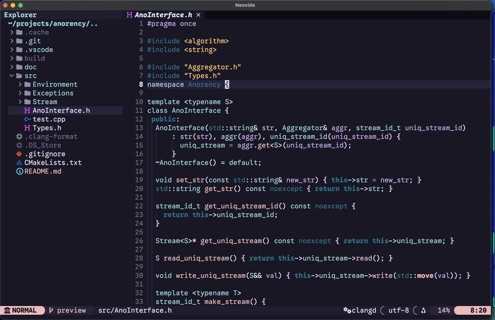

# Neovim Configuration

Chill style.

## Features

- Google Sans Code with patched nerd fonts. Check https://github.com/Zhou-London/gscpp
- Customized icons.
- Highlight is better than icons.

## Installation

Clone this repo into ~/.config/nvim
